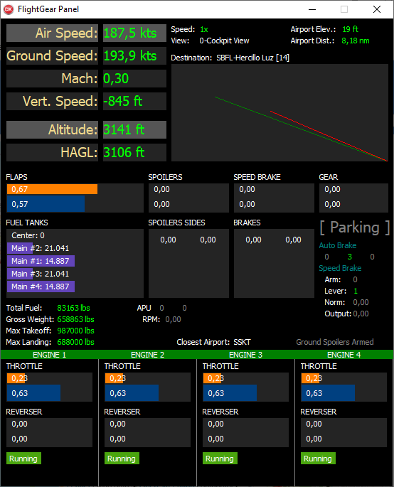

# FlightGear-Panel
FlightGear real time flight controls/instruments/parameters and descent ramp graph



*On final approach, landing a Boeing 747-8*

## Description

This is an application made in Delphi (FMX) to be executed together with FlightGear, in order to show the flight parameters, without having to check them directly in FlightGear.

I developed this program because, several times using the simulator, I came across the difficulty of knowing the current status of a certain parameter during a flight.

You are landing the plane, and at this moment you need to make several parameters, but you don't have a copilot to help you because you are just using the simulator, and you want to keep the screen with the view from the window, to see the runway.

So, let's say you want to lower the flaps. In the simulator, you can use the keyboard or the joystick for this, but you will not get feedback that it was actually performed on the aircraft. And normally, with the view from the window you will not be able to see the flaps lever at the same time.

Several times using the simulator, it occurred to me to command the flaps and then discover that they had not lowered, or else to command the landing gear and wonder if it worked.

With this in mind, I developed this application that communicates using UDP socket with FlightGear and shows several parameters of the aircraft in real time, including the commanded values ​​and the values ​​in operation. For example, if you command the flaps, there is the value you commanded, and the actual surface position.

**To use this application together with the simulator, it is essential to have 2 monitors. If not, you can also use the application on another computer, communicating over a network.**

## How to use

1. Use XMLGen app to generate PropertyList XML file specifying the FlightGear installation directory.

2. Run FGPanel app (an UDP Server socket will automatically start).
   *If you are going to use this app on another remote computer, remember to allow access through the firewall.*
   
3. Run FlightGear specifying the following command-line argument (FlightGear > Settings > Additional Settings):
```
--generic=socket,out,20,localhost,6688,udp,digao_panel
```

> Replace "localhost" by the remote computer address if you are using remote app.

**The next time you play, you only need to open FGPanel and FlightGear.**
